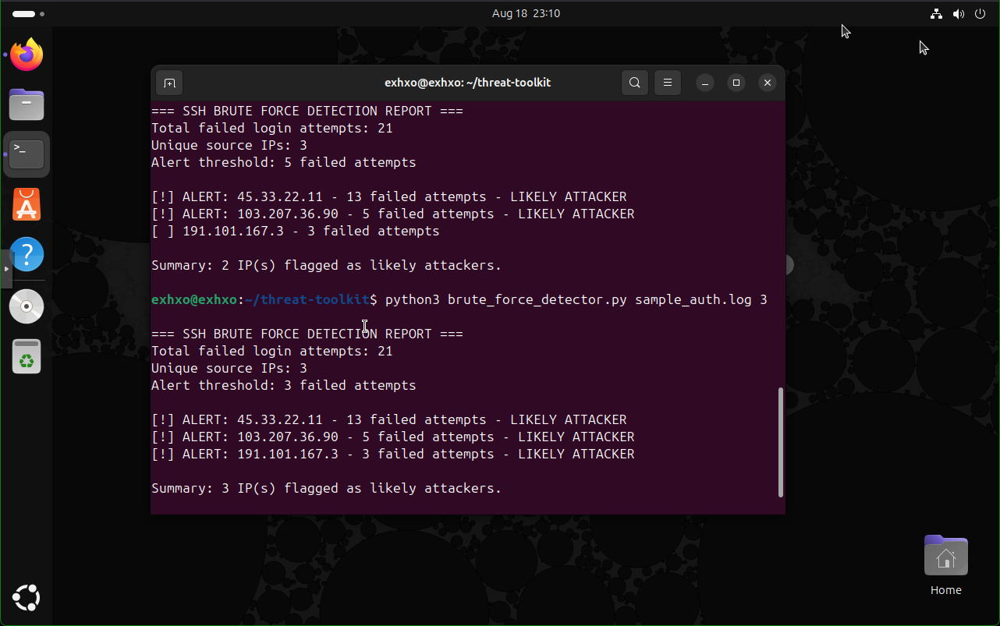

# 🐍 SSH Brute Force Detector — Threat Detection Automation


## Objective
A Python tool that analyzes authentication logs to automatically detect SSH brute force attacks. It parses log files, extracts the source IPs behind failed login attempts, ranks them by frequency, and flags any IP exceeding a configurable threshold as a likely attacker. This project demonstrates security automation and detection engineering through custom-built tooling — writing code that identifies threats rather than relying solely on off-the-shelf platforms.

---

## Why This Tool

Security engineers don't just operate tools — they build them. Manually scanning through thousands of log lines for attack patterns is slow and error-prone. This detector automates that analysis: point it at a log file and it instantly surfaces the IPs conducting brute force attacks, ranked by severity. It's the kind of lightweight, purpose-built automation that extends a SOC's capabilities beyond what its platforms provide out of the box.

---

## What It Does

- Parses any Linux authentication log (`auth.log` format)
- Identifies all failed SSH login attempts
- Extracts the source IP address from each attempt using regex
- Counts and ranks IPs by number of failed attempts
- Flags IPs exceeding a configurable threshold as likely attackers
- Produces a clean, analyst-ready detection report

---

## Usage

```bash
python3 brute_force_detector.py <logfile> [threshold]
```

**Examples:**
```bash
# Analyze a log with the default threshold (5)
python3 brute_force_detector.py /var/log/auth.log

# Analyze with a custom threshold of 3
python3 brute_force_detector.py sample_auth.log 3
```

The optional `threshold` argument sets how many failed attempts trigger an attacker alert, letting you tune sensitivity without editing the code.

---

## Sample Output

```
=== SSH BRUTE FORCE DETECTION REPORT ===
Total failed login attempts: 21
Unique source IPs: 3
Alert threshold: 5 failed attempts

[!] ALERT: 45.33.22.11 - 12 failed attempts - LIKELY ATTACKER
[!] ALERT: 103.207.36.90 - 5 failed attempts - LIKELY ATTACKER
[ ] 191.101.167.3 - 3 failed attempts

Summary: 2 IP(s) flagged as likely attackers.
```



---

## How It Works

The tool follows a four-stage detection pattern used across log-analysis tooling:

| Stage | Action | Technique |
|-------|--------|-----------|
| **Read** | Open and read the log file line by line | File I/O with safe context management |
| **Filter** | Isolate only "Failed password" events | String matching in a loop |
| **Extract** | Pull the source IP from each failed attempt | Regular expressions (`re` module) |
| **Analyze** | Count, rank, and flag IPs by frequency | `collections.Counter` + threshold logic |

### Key Techniques Demonstrated

- **Regular expressions** — extracting IP addresses from unstructured log text with the pattern `from (\d+\.\d+\.\d+\.\d+)`
- **Functions** — code organized into `parse_log()`, `detect_attackers()`, and `main()` for clarity and reuse
- **Command-line arguments** — flexible input via `sys.argv`, so the tool works on any log file
- **Error handling** — graceful failure with `try/except` when a file is missing
- **Frequency analysis** — `Counter.most_common()` to rank threats worst-first

---

## Detection Logic

The core insight: **legitimate users don't fail SSH login dozens of times from the same IP.** A high volume of failed attempts from a single source is the signature of an automated brute force attack. By counting failures per IP and comparing against a threshold, the tool separates attackers (many rapid failures) from users who simply mistyped a password (a handful of failures).

The threshold is configurable because the right value depends on context — a stricter threshold catches attacks faster but may flag noisy users; a looser one reduces false positives. Making it tunable at runtime reflects how real detection rules are calibrated to an environment.

---

## Files

| File | Description |
|------|-------------|
| `brute_force_detector.py` | The detection tool |
| `sample_auth.log` | Sample log with embedded brute force patterns for testing |

The included sample log contains three attacking IPs of varying intensity plus legitimate activity (successful logins, cron jobs, sudo commands), so the tool can be tested against realistic mixed data.

---

## Skills Demonstrated

- Python scripting for security automation
- Log parsing and analysis
- Regular expressions for data extraction
- Threat detection logic and threshold tuning
- Professional code structure (functions, arguments, error handling)
- Building custom security tooling

---

## Future Enhancements

This is the foundation of a broader detection toolkit. Planned extensions:
- Automated alerting (email/file report) on detection
- IOC extraction across multiple indicator types
- Integration with threat intelligence enrichment
- Automated response actions (firewall blocking)

---

## Part of a SOC Lab Project Series

| Project | Focus |
|---------|-------|
| SIEM Implementation & Log Analysis | Detection (Splunk) |
| Network Traffic Monitoring & Attack Detection | Packet analysis |
| Security Automation with Shuffle SOAR | Automation & enrichment |
| Incident Response (NIST 800-61) | IR process & execution |
| SOC Case Management with TheHive | Case management |
| **Threat Detection Automation (Python)** | **Custom security tooling** |
